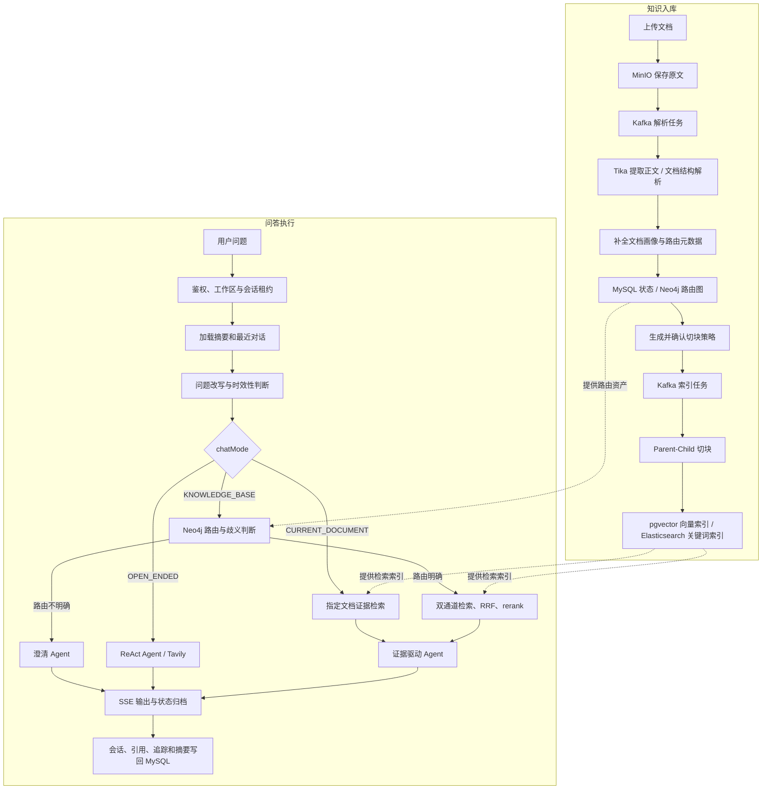
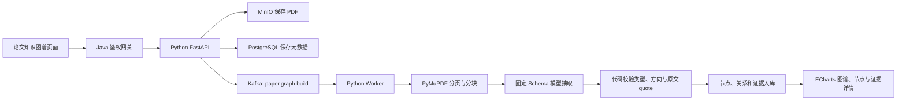

# LabMind

LabMind 是面向团队知识资产的全栈 AI 助手。它不只是聊天页面，而是把文档接入、结构解析、知识路由、混合检索、Agent 执行、流式回答、权限隔离和调用观测串成一条完整链路。

前端提供文档助手、论文知识图谱和管理后台；Java 后端负责鉴权、问答编排与 Python 接口接入，独立 Python 服务负责论文图谱构建和查询。

## 核心能力

- **三种问答模式**：当前文档问答、自动知识问答、开放式提问由请求中的 `chatMode` 明确决定。
- **知识文档接入**：支持 PDF、Word、TXT、Markdown、HTML 和 PowerPoint，原文与解析正文存入 MinIO，处理状态和任务日志写入 MySQL。
- **结构化知识路由**：从文档画像构建知识域、专题、文档、术语和问题模式，使用 Neo4j 完成 Scope → Topic → Document 三级收缩和候选排序。
- **混合 RAG 检索**：pgvector 负责向量召回，Elasticsearch 负责关键词召回，两路结果经过 RRF 融合、可选 rerank 和 Parent 证据组装后进入回答上下文。
- **Agent 执行**：知识问答按证据生成、回答、引用三个步骤执行；开放式问题使用带 Tavily 搜索工具的 ReAct Agent，并对模型调用、工具调用、重试和并发设置明确预算。
- **模型管理**：后台可维护 DashScope、DeepSeek、智谱 AI 的模型地址、名称、启用状态和顺序，系统匹配对应计价信息，API Key 使用 AES-GCM 加密保存。
- **工作区与权限**：支持访客、普通用户、超级管理员角色，账号、会话和知识文档按工作区隔离。
- **流式与可观测性**：通过 SSE 推送正文、引用、推荐追问和完成状态；保存执行阶段、模型调用、工具调用、Token、费用、延迟及失败信息。
- **论文知识图谱**：独立上传计算机领域论文，以固定 7 类实体和 6 类关系构图，每条关系绑定页码、Chunk 和原文证据；该模块不进入原 RAG 链路。

## 系统主链路



### 问答模式

| 模式 | 输入与处理 | 结果 |
| --- | --- | --- |
| `CURRENT_DOCUMENT` | 用户明确选择文档；主链路仅在该文档内检索，同时异步记录一次影子路由用于评估自动路由质量 | 基于当前文档证据回答并生成引用 |
| `KNOWLEDGE_BASE` | Neo4j 先筛选知识域、专题和文档；候选不足或跨域分数接近时由确定性规则触发澄清，否则进入混合检索 | 澄清问题，或基于命中文档证据回答 |
| `OPEN_ENDED` | 不读取内部知识库；ReAct Agent 判断是否需要 Tavily 搜索，并受模型与工具调用预算约束 | 通用回答或联网检索后的回答 |

知识模式未检索到正文证据时会直接结束本轮，不调用模型编造答案。同一会话已有任务运行时，新请求返回 `TURN_REJECTED`；执行失败或客户端中止分别归档为 `FAILED` 或 `STOPPED`，并释放 Redis 会话租约。

### 论文知识图谱链路

论文图谱是与上述问答链路平行的 Python 模块：



Python 只使用 `Paper`、`Method`、`Task`、`Dataset`、`MetricResult`、`Baseline`、`Limitation`，以及 `PROPOSES`、`SOLVES`、`USES`、`ACHIEVES`、`OUTPERFORMS`、`HAS_LIMITATION`。解析、模型、Schema 或证据校验失败时，文档进入 `FAILED` 并保留错误；不会尝试其他解析器或保存无证据关系。

### 文档处理

文档上传后进入可追踪的异步任务链路：

1. 保存原始文件并创建文档、解析任务和任务日志。
2. Kafka 消费端校验当前任务身份，使用 Apache Tika 提取正文，再解析标题、章节和段落结构。
3. 结合上传元数据与模型结果生成文档摘要、知识域、专题、术语、可回答问题和问题模式。
4. 将业务状态写入 MySQL，将可路由资产写入 Neo4j；正文仍保留在 MinIO，不与路由图混存。
5. 根据结构、递归和语义策略构建 Parent-Child 块，同时写入 pgvector 与 Elasticsearch。

旧任务、计划不匹配、解析失败或索引失败都会显式失败并记录日志，不会把不完整文档标记为可用。

## 组件职责

| 组件 | 职责 |
| --- | --- |
| Vue 3 + TypeScript + Vite | 问答、文档接入、知识路由、会话观测、模型、账号和工作区管理界面 |
| Spring Boot + Spring AI Alibaba | REST/SSE 接口、对话编排、Agent、模型与工具调用 |
| Python + FastAPI | 论文上传、版本、PDF 分块、固定 Schema 抽取、证据校验和图谱查询 |
| MySQL | 用户与工作区、文档状态、任务、会话、轮次、记忆摘要、调用轨迹和模型配置 |
| Redis / Redisson | 会话租约、Agent 调用计数和分布式并发控制 |
| Kafka | 文档解析、索引构建和当前文档影子路由任务 |
| MinIO | 文档原文件和解析后的纯文本 |
| Neo4j | 知识域、专题、文档、术语、问题模式及文档结构图 |
| PostgreSQL + pgvector | 文档块向量与语义检索 |
| PostgreSQL 关系表 | 独立保存论文图谱空间、文档、Chunk、节点、关系和原文证据 |
| Elasticsearch | 文档块关键词检索 |

## 项目结构

```text
frontend/          Vue 前端与管理后台
lab-mind-backend/  Maven 聚合工程、业务服务、共享模块和基础框架
paper-graph-service/ 独立 Python 论文知识图谱 API 与 Worker
sql/               MySQL、pgvector、Elasticsearch 初始化与迁移脚本
docs/              对话记忆、RAG 编排、检索生成和 SSE 链路文档
scripts/           本地启动脚本
```

后端运行入口位于 `lab-mind-backend/services/lab-mind-business/lab-mind-business-chat`。

## 本地启动

准备 JDK 25、Maven 3.9.11、Python 3.12、Node.js/npm，以及 MySQL、Redis、Kafka、MinIO、Neo4j、PostgreSQL/pgvector 和 Elasticsearch。

数据库与索引初始化文件：

- [MySQL](sql/lab-mind-business-chat/mysql/init)
- [pgvector](sql/lab-mind-business-chat/pgvector/init)
- [Elasticsearch](sql/lab-mind-business-chat/elasticsearch/init/001_create_document_chunk_index.json)
- [论文知识图谱 PostgreSQL](sql/lab-mind-paper-graph/postgresql/init/001_create_paper_graph_tables.sql)

复制环境变量模板，并根据后端配置补齐连接信息与 API Key：

```bash
cp .env.example .env
cp paper-graph-service/.env.example paper-graph-service/.env
```

论文图谱服务的环境、初始化和双进程启动方式见 [`paper-graph-service/README.md`](paper-graph-service/README.md)。启动 Python API 和 Worker 后，再启动 Java 后端；根目录 `.env` 中的 Python 服务地址与内部令牌必须和 Python `.env` 一致。

启动后端：

```bash
./scripts/run-business-chat-local.sh
```

在另一个终端启动前端：

```bash
cd frontend
npm ci
npm run dev
```

访问 `http://localhost:5173`。前端将 `/backend` 请求代理到 `http://127.0.0.1:8080`。

环境变量定义见 [`.env.example`](.env.example)，完整后端配置见 [`application.yaml`](lab-mind-backend/services/lab-mind-business/lab-mind-business-chat/src/main/resources/application.yaml)。

## 详细链路文档

- [会话记忆加载](docs/chat-memory-phase1.md)
- [RAG 前置编排](docs/chat-rag-phase2.md)
- [混合检索与 Agent 执行](docs/chat-rag-phase3.md)
- [SSE 输出与收尾归档](docs/chat-sse-phase4.md)
