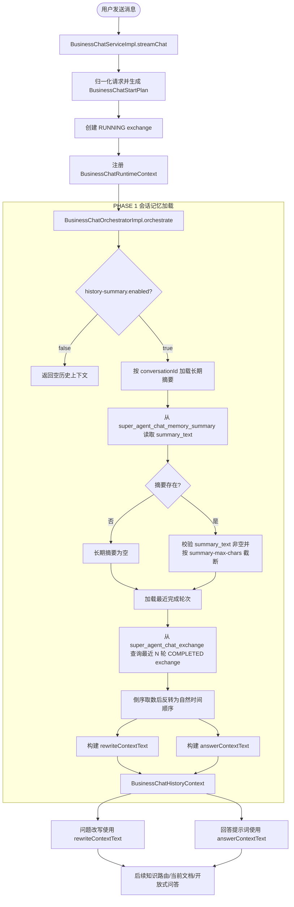
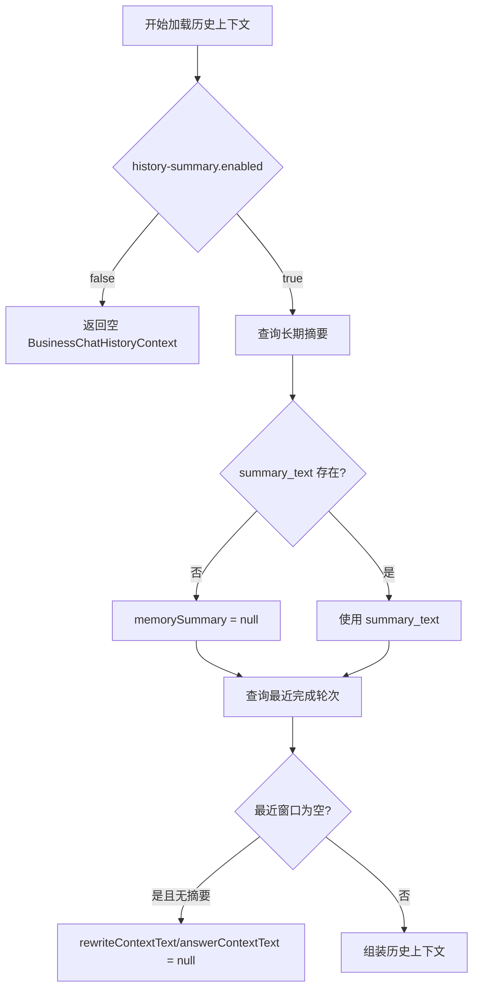
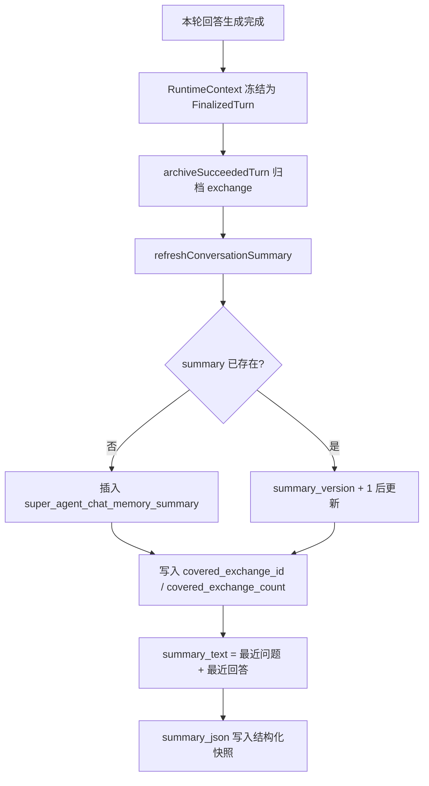

# Phase 1 会话记忆加载链路

本文说明当前项目中“用户发送消息后，从 MySQL 加载会话记忆”的真实实现。这里的“会话记忆”不是一个独立 Agent，也不是 LLM 实时总结出来的临时内容，而是由 MySQL 中的长期摘要和最近完成轮次共同组成，随后进入问题改写、知识路由和回答生成。

## 总览



## 入口位置

用户消息进入后，主入口是 `BusinessChatServiceImpl.streamChat()`。它负责创建本轮运行态，然后调用 `BusinessChatOrchestratorImpl.orchestrate()` 生成执行计划。

关键链路：

1. `BusinessChatServiceImpl.streamChat()`
2. `normalizeRequestAndBuildStartPlan()`
3. `createTurnRecordAndBuildTaskInfo()`
4. `registerRuntimeWorkbench()`
5. `BusinessChatOrchestratorImpl.orchestrate()`
6. `loadHistoryContext()`

会话记忆加载发生在 `BusinessChatOrchestratorImpl.loadHistoryContext()`，也就是模型回答之前、问题改写之前。

## 数据来源

### 长期摘要表

长期摘要来自 MySQL 表 `super_agent_chat_memory_summary`：

```sql
CREATE TABLE IF NOT EXISTS super_agent_chat_memory_summary (
    id BIGINT NOT NULL COMMENT '主键id',
    dialogue_code VARCHAR(64) NOT NULL COMMENT '所属业务会话编号',
    covered_exchange_id BIGINT NOT NULL DEFAULT '0' COMMENT '长期摘要已覆盖到的最后一条exchangeId',
    covered_exchange_count INT NOT NULL DEFAULT '0' COMMENT '长期摘要已覆盖的轮次数',
    compression_count INT NOT NULL DEFAULT '0' COMMENT '累计压缩次数',
    summary_version INT NOT NULL DEFAULT '0' COMMENT '摘要版本号',
    summary_text LONGTEXT NOT NULL COMMENT '编排阶段直接使用的长期摘要文本',
    summary_json JSON DEFAULT NULL COMMENT '长期摘要结构化JSON',
    last_source_edit_time DATETIME DEFAULT NULL COMMENT '摘要覆盖源轮次的最后更新时间',
    status TINYINT(1) DEFAULT '1' COMMENT '1:正常 0:删除'
);
```

读取条件是：

- `dialogue_code = 当前 conversationId`
- `status = 1`
- `limit 1`

读取后只使用 `summary_text` 进入编排上下文。`summary_json` 主要用于详情展示，不参与当前问题改写和回答上下文组装。

### 最近对话窗口

最近窗口来自 MySQL 表 `super_agent_chat_exchange`。查询条件是：

- `dialogue_code = 当前 conversationId`
- `status = 1`
- `exchange_state = COMPLETED`
- 按 `create_time desc, id desc` 取最近 `keep-recent-turns` 轮

代码取到倒序列表后，会反转成自然时间顺序。这样放进提示词时，历史对话是从旧到新排列，避免模型看到倒置的上下文。

## 配置项

配置在 `application.yaml`：

```yaml
super-agent:
  chat:
    history-summary:
      enabled: true
      keep-recent-turns: 4
      compression-batch-turns: 6
      recent-transcript-max-chars: 2200
      summary-max-chars: 1400
```

当前实际生效含义：

| 配置 | 当前作用 |
| --- | --- |
| `enabled` | 是否加载会话历史。关闭后直接返回空历史上下文。 |
| `keep-recent-turns` | 最近窗口保留多少轮已完成 exchange。 |
| `recent-transcript-max-chars` | `rewriteContextText` 和 `answerContextText` 的最大字符数。 |
| `summary-max-chars` | 长期摘要 `summary_text` 的最大字符数。 |
| `compression-batch-turns` | 当前配置类中存在，但现有摘要刷新逻辑没有按批次触发压缩。 |

## 上下文组装规则

`BusinessChatHistoryContext` 有四个字段：

```java
BusinessChatHistoryContext(
    String rewriteContextText,
    String answerContextText,
    String memorySummary,
    List<BusinessChatRecentExchange> recentExchangeList
);
```

### rewriteContextText

用于问题改写。它包含：

- 长期摘要
- 最近对话里的时间和用户问题

它不包含最近对话中的助手回答正文。这样做的效果是：问题改写只根据用户连续提问补全指代对象，不把上一轮助手回答直接塞进改写结果里。

格式大致是：

```text
长期摘要：
...

最近对话：
时间：...
用户：...
```

### answerContextText

用于最终回答提示词。它包含：

- 长期摘要
- 最近对话里的时间
- 用户问题
- 助手回答

格式大致是：

```text
长期摘要：
...

最近对话：
时间：...
用户：...
助手：...
```

它比 `rewriteContextText` 更完整，因为回答生成需要理解上一轮问答的内容，而不只是判断用户当前问题里的指代。

## 无记忆路径

当前实现里有三种“无记忆”情况：



需要注意：如果数据库里存在摘要记录，但 `summary_text` 为空，当前实现不会静默忽略，而是抛出异常。这符合项目规则：不使用默认值或 fallback 掩盖业务数据错误。

## 摘要写回链路

当前摘要不是在 Phase 1 现场生成，而是在一轮回答成功后刷新，供下一轮使用。



当前 `summary_text` 的内容是最近一轮问答快照：

```text
会话编号：...
最近问题：...
最近回答：...
```

也就是说，现有实现里的“摘要压缩”不是 LLM 对多轮历史做语义压缩，而是把最近成功轮次写成长期摘要快照。真正覆盖多轮语义的能力，主要来自“长期摘要 + 最近窗口”的组合，其中最近窗口保留最近 `keep-recent-turns` 轮完整问答。

## 与图中概念的对应

| 图中概念 | 当前项目实现 |
| --- | --- |
| 用户发送消息 | `BusinessChatServiceImpl.streamChat()` |
| 从 MySQL 加载会话记忆 | `BusinessChatOrchestratorImpl.loadConversationMemory()` + `loadRecentExchangeList()` |
| 无记忆 | 没有摘要且最近窗口为空时，上下文为 `null` |
| 滑动窗口 | 最近 `keep-recent-turns` 轮 `COMPLETED` exchange |
| 摘要压缩 | 当前是成功轮次结束后刷新 `summary_text`，不是独立 LLM 多轮压缩 |
| 给问题改写使用 | `rewriteContextText` |
| 给回答生成使用 | `answerContextText` |

## 关键代码位置

- `BusinessChatServiceImpl`
  - 负责用户消息入口、运行态创建、执行计划触发、成功后刷新摘要。
- `BusinessChatOrchestratorImpl`
  - `loadHistoryContext()`：Phase 1 主逻辑。
  - `loadConversationMemory()`：读取长期摘要。
  - `loadRecentExchangeList()`：读取最近窗口。
  - `buildRewriteHistoryContextText()`：构建问题改写上下文。
  - `buildAnswerHistoryContextText()`：构建回答上下文。
- `BusinessChatPersistenceServiceImpl`
  - `refreshConversationSummary()`：成功回答后刷新摘要。
  - `fillSummary()`：写入 `summary_text` 和 `summary_json`。
- `BusinessChatHistorySummaryProperties`
  - 绑定 `super-agent.chat.history-summary` 配置。

## 当前链路结论

当前项目已经实现了图中 Phase 1 的主干：用户发送消息后，会在编排阶段从 MySQL 加载会话历史，并形成“长期摘要 + 最近对话窗口”的上下文。

但要准确描述现状，需要把“摘要压缩”说清楚：当前不是独立的 LLM 摘要压缩器，而是在每轮成功归档后刷新一份最近问答摘要；最近多轮细节依赖滑动窗口提供。这个实现能支撑连续问答、指代改写和回答上下文补充，但还不是严格意义上的多轮语义压缩记忆系统。
