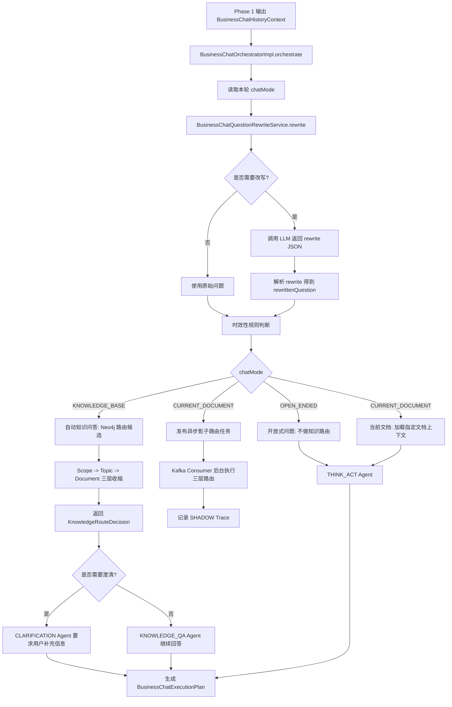
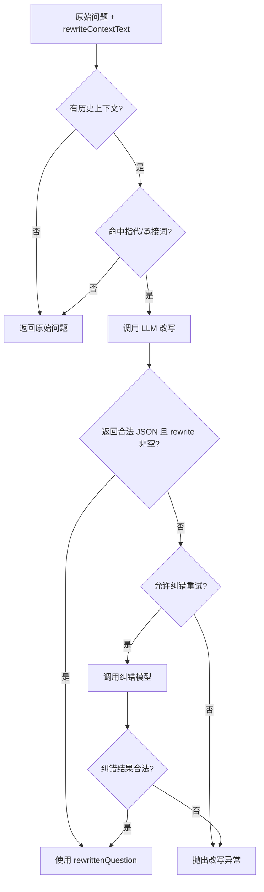
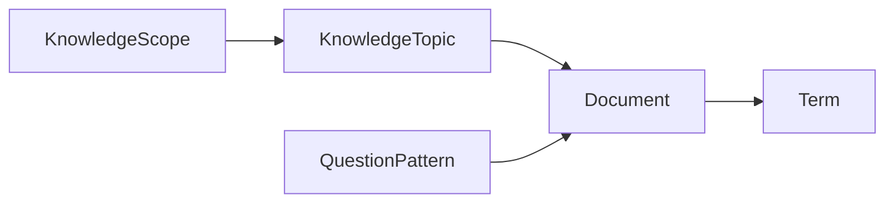
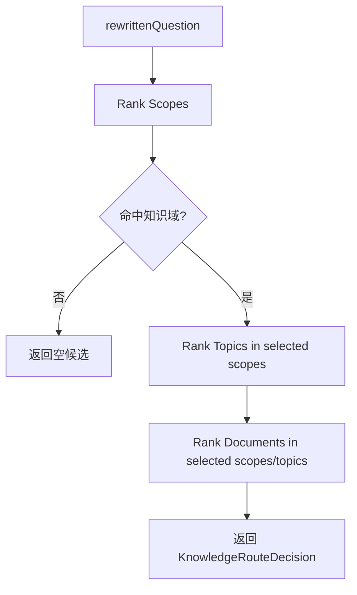
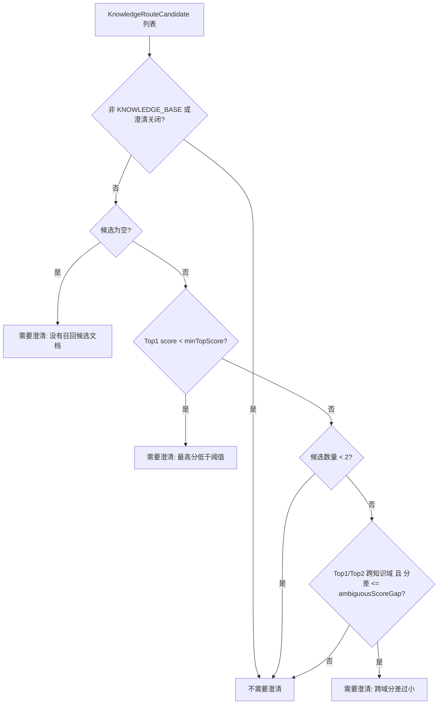
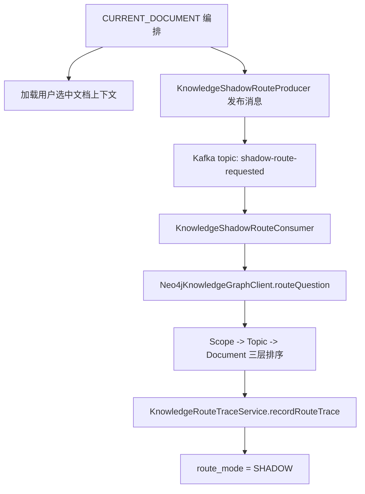

# Phase 2 RAG 前置编排链路

本文说明当前项目中“会话记忆加载之后，进入 RAG 前置编排”的真实实现。它覆盖问题改写、路由判断、歧义澄清、知识域收缩、当前文档影子路由、开放式问题分支，以及执行计划如何交给后续 Agent。

这里需要先明确一个边界：当前项目没有独立的“LLM 意图分类器”。LLM 在 Phase 2 中只参与问题改写；所谓意图标签和执行分支，是由 `chatMode`、知识候选、澄清规则共同推导出来的。

## 总览



## 入口和顺序

Phase 2 的入口仍然是 `BusinessChatOrchestratorImpl.orchestrate()`。它接收 Phase 1 生成的 `BusinessChatHistoryContext`，然后按固定顺序生成 `BusinessChatExecutionPlan`。

核心顺序：

1. 加载历史上下文：`loadHistoryContext()`
2. 读取本轮模式：`runtimeContext.getTaskInfo().chatMode()`
3. 问题改写：`questionRewriteService.rewrite(...)`
4. 时效性判断：`detectFreshnessRequirement(...)`
5. 知识路由决策：`routeKnowledgeDecision(...)`
6. 路由追踪处理：知识库模式同步写 AUTO trace；当前文档模式发布异步 SHADOW 任务
7. 歧义澄清判断：`buildClarificationPlan(...)`
8. 当前文档上下文加载：`buildSelectedDocumentContextText(...)`
9. 生成路由摘要：`routeKnowledge(...)`
10. 推导意图标签和 Agent 类型：`buildIntentLabel(...)`、`selectAgentType(...)`
11. 输出 `BusinessChatExecutionPlan`

## chatMode 决定大方向

当前项目的模式枚举是 `BusinessChatMode`：

| 当前模式 | 图中含义 | 当前行为 |
| --- | --- | --- |
| `OPEN_ENDED` | 开放式问题 | 不做知识路由，直接走 `THINK_ACT`。 |
| `CURRENT_DOCUMENT` | 用户已明确指定文档 | 主回答不做自动路由，加载指定文档画像和正文，走 `THINK_ACT`；同时发布异步影子路由任务，只用于质量观测。 |
| `KNOWLEDGE_BASE` | 自动匹配知识库 | 先改写问题，再做知识路由和澄清判断，最终走 `KNOWLEDGE_QA` 或 `CLARIFICATION`。 |

这意味着当前系统不是让 LLM 判断“开放式/知识库/文档问答”。这个大方向来自前端请求里的 `chatMode`。

## 问题改写

问题改写由 `BusinessChatQuestionRewriteService` 完成。它不是无条件调用 LLM，而是先走规则判断。

触发条件：

- 有 Phase 1 生成的 `rewriteContextText`
- 当前问题命中指代或承接词

当前指代/承接词包括：

```text
它、它们、他们、这个、这些、这里、这块、上述、上面、刚才、前面、前者、后者、该方案、这种方式、那、然后呢、继续、还有呢
```

不满足触发条件时，直接返回原始问题。满足触发条件时，会调用 LLM，并要求只输出 JSON：

```json
{
  "rewrite": "改写后的独立问题"
}
```

改写约束很明确：

- 只补全指代对象、省略对象和承接对象
- 保留当前问题原有动作、范围、时间、环境、角色、限制条件
- 不回答问题
- 不扩展问题范围
- 不添加历史上下文和当前问题都没有出现的信息
- 不拆成多个问题

如果模型第一次输出不是合法 JSON，且配置 `correction-retry-enabled: true`，会再调用一次纠错模型。纠错仍然只允许修正 JSON 格式和改写字段，不允许改变业务范围。



## 时效性判断

`detectFreshnessRequirement()` 是纯规则判断，用来识别问题是否要求实时信息。

当前命中规则：

- 明确实时词：`今天`、`现在`、`当前`、`实时`、`最新`、`刚刚`
- 或者“相对时间词 + 外部对象词”组合：
  - 相对时间词：`最近`、`本周`、`今年`
  - 外部对象词：`价格`、`股价`、`汇率`、`天气`、`新闻`、`政策`、`公告`、`版本`、`发布`

当前系统没有外部实时检索执行器，所以命中后不会去联网检索，而是把 `capability = UNAVAILABLE` 写进执行计划，让后续回答明确边界。

## 知识路由

只有 `KNOWLEDGE_BASE` 模式会进入知识路由：

```text
if (executionMode != BusinessChatMode.KNOWLEDGE_BASE) {
    return List.of();
}
return knowledgeGraphClient.routeQuestion(rewrittenQuestion, 5);
```

当前知识路由使用 `Neo4jKnowledgeGraphClient`，图结构是：



文档画像同步到 Neo4j 时，会写入：

- 知识域 `KnowledgeScope`
- 知识专题 `KnowledgeTopic`
- 文档 `Document`
- 术语 `Term`
- 问题模式 `QuestionPattern`

路由查询按三层递进收缩：



### Scope 收缩

先在所有可路由文档上统计：

- 问题是否包含术语
- 问题是否包含问题模式
- 问题是否包含知识域名称

只有 `score > 0` 的知识域会进入下一步。

### Topic 收缩

只在候选知识域内继续统计：

- 术语命中
- 问题模式命中
- 专题名称命中

Top scope 会有额外 boost。

### Document 收缩

只在候选知识域和候选专题内选文档，评分来自：

- 术语命中分
- 问题模式命中分
- 摘要匹配分
- Top scope boost
- Top topic boost

最后返回 `KnowledgeRouteDecision`，其中包含：

- `scopeCandidates`：Scope 排序候选
- `topicCandidates`：Topic 排序候选
- `documentCandidates`：Document 排序候选

`documentCandidates` 中的每个 `KnowledgeRouteCandidate` 包含：

- `documentId`
- `documentName`
- `scopeCode` / `scopeName`
- `topicCode` / `topicName`
- `score`
- `termScore`
- `patternScore`
- `hitTerms`
- `matchedPatterns`
- `hitReason`

Scope 和 Topic 候选会转换为 `KnowledgeRouteRankedCandidate`，保存候选类型、候选编码、候选名称、分数和命中原因。

## 路由追踪

知识路由追踪由 `KnowledgeRouteTraceService.recordRouteTrace(...)` 写入。它不重新计算路由，只保存本轮已经得到的 `KnowledgeRouteDecision` 快照。

主表 `lab_mind_knowledge_route_trace` 保存：

- 原始问题 `question`
- 改写问题 `rewritten_question`
- 选中 Scope / Topic
- Top Document id 列表
- 完整 `route_result_json`
- 用户手动选择的文档 `user_selected_document_id`
- 路由第一名文档 `route_top_document_id`
- 是否命中 `hit_selected_document`
- 置信度 `confidence`
- 路由状态 `route_status`
- 路由模式 `route_mode`

明细表 `lab_mind_knowledge_route_trace_candidate` 保存三级 Top3 候选：

- `candidate_type = SCOPE`：Top3 Scope 候选
- `candidate_type = TOPIC`：Top3 Topic 候选
- `candidate_type = DOCUMENT`：Top3 Document 候选

`hit_selected_document` 的语义只针对影子路由：用户手动选择的文档与系统路由 Top1 Document 一致时为 `1`，不一致时为 `0`。当没有用户手动选择文档或没有 Top1 Document 时，该值为空。

`route_status` 由 Document 候选和置信度决定：

- 没有 Document 候选：`FAILED`
- 置信度达到 `success-confidence`：`SUCCESS`
- 有候选但置信度不足：`LOW_CONFIDENCE`

## 歧义澄清判断

澄清判断由 `buildClarificationPlan()` 完成，只对 `KNOWLEDGE_BASE` 模式生效。



当前配置：

```yaml
lab-mind:
  chat:
    clarification:
      enabled: true
      max-options: 3
      min-top-score: 1.0
      ambiguous-score-gap: 0.8
```

澄清触发条件：

1. 没有候选文档
2. Top1 分数低于 `min-top-score`
3. Top1 和 Top2 属于不同知识域，并且分差小于等于 `ambiguous-score-gap`

澄清时会生成 `BusinessChatClarificationPlan`，并选择 `CLARIFICATION` Agent。回复内容会要求用户补充文档名、业务范围或更具体关键词；如果有候选，会列出最多 `max-options` 个候选文档让用户选择。

## 路由摘要与执行分支

当前项目会生成 `knowledgeRoute` 字符串，供 debugTrace 和后台追踪页阅读。它不是新的执行开关，真正的执行开关已经由 `chatMode` 和 `clarificationPlan` 决定。

路由摘要规则：

| 模式/条件 | `knowledgeRoute` |
| --- | --- |
| `CURRENT_DOCUMENT` | `CURRENT_DOCUMENT` |
| `KNOWLEDGE_BASE` 且无候选 | `KNOWLEDGE_BASE\|NO_DOCUMENT_MATCH` |
| `KNOWLEDGE_BASE` 且有候选 | `KNOWLEDGE_BASE\|DOCUMENT_MATCHED` |
| `OPEN_ENDED` | `NOT_REQUIRED` |
| 需要实时信息 | 追加 `FRESHNESS_REQUIRED` |
| 需要澄清 | 追加 `CLARIFICATION_REQUIRED` |

Agent 选择规则：

| 条件 | Agent |
| --- | --- |
| 需要澄清 | `CLARIFICATION` |
| `KNOWLEDGE_BASE` 且不需要澄清 | `KNOWLEDGE_QA` |
| `CURRENT_DOCUMENT` | `THINK_ACT` |
| `OPEN_ENDED` | `THINK_ACT` |

意图标签规则：

| 条件 | intentLabel |
| --- | --- |
| 需要澄清 | `knowledge_route_clarification` |
| `CURRENT_DOCUMENT` | `document_question_answer` |
| `KNOWLEDGE_BASE` | `knowledge_question_answer` |
| `OPEN_ENDED` | `open_ended_question_answer` |

因此，当前项目里的“意图”本质上是编排结果，不是 LLM 分类结果。

## 当前文档分支

`CURRENT_DOCUMENT` 不走自动知识路由。它要求入口已经绑定 `selectedDocumentId`，然后在编排阶段加载：

- 文档画像
- 可回答问题
- 不可回答问题
- 业务实体
- 术语
- 问题模式
- 文档解析正文

这些内容拼成 `selectedDocumentContextText`，交给后续模型回答。任一关键数据缺失会直接失败，不通过默认值或兜底逻辑掩盖。

当前文档模式还会发布一条异步影子路由任务：



影子路由不改变主回答路径。主回答始终使用用户手动选择的文档上下文；影子路由只把系统自动路由结果和用户选择做对比，用来评估路由质量。

## 开放式问题分支

`OPEN_ENDED` 不走知识路由，不加载当前文档上下文，`knowledgeRoute = NOT_REQUIRED`，最终进入 `THINK_ACT` Agent。

如果开放式问题命中实时信息规则，执行计划会记录 `FRESHNESS_REQUIRED`，但仍不会进行外部实时检索。后续模型需要说明无法验证实时信息。

## 与图中概念的对应

| 图中概念 | 当前项目实现 |
| --- | --- |
| RAG 前置编排 | `BusinessChatOrchestratorImpl.orchestrate()` |
| LLM 意图分析 | 当前没有独立 LLM 意图分类；LLM 只做问题改写 |
| 问题改写 | `BusinessChatQuestionRewriteService.rewrite()` |
| 路由判定 | `chatMode` 分支 + `routeKnowledgeDecision()` |
| 存在歧义 | `buildClarificationPlan()` 返回 required=true |
| 歧义澄清 | `CLARIFICATION` Agent |
| 匹配知识库 | `KNOWLEDGE_BASE` 且候选稳定 |
| 知识域收缩 | `Neo4jKnowledgeGraphClient.routeQuestion()` 的 Scope -> Topic -> Document，返回 `KnowledgeRouteDecision` |
| 当前文档影子路由 | `KnowledgeShadowRouteProducer` 发布异步任务，`KnowledgeShadowRouteConsumer` 后台路由并记录 SHADOW trace |
| 开放式问题 | `OPEN_ENDED`，不做知识路由 |

## 当前实现边界

1. 当前没有独立 LLM 意图分类器。
2. 当前知识库路由返回 `KnowledgeRouteDecision`，包含 Scope、Topic、Document 三级候选；不在编排阶段读取候选文档正文。
3. 当前知识库模式没有单独的 `GRAPH / RETRIEVAL` 二级分流。
4. 当前时效性判断只记录能力边界，不触发外部实时检索。
5. 当前问题改写只输出单个 `rewrite`，不输出 `sub_questions`。

## 关键代码位置

- `BusinessChatOrchestratorImpl`
  - `orchestrate()`：Phase 2 主编排。
  - `routeKnowledgeDecision()`：知识库模式调用 Neo4j 路由。
  - `recordKnowledgeRouteTrace()`：知识库模式同步记录 AUTO trace；当前文档模式发布 SHADOW 任务。
  - `buildClarificationPlan()`：澄清规则。
  - `routeKnowledge()`：生成路由摘要。
  - `buildIntentLabel()`：推导意图标签。
  - `selectAgentType()`：选择 Agent。
- `BusinessChatQuestionRewriteService`
  - `rewrite()`：问题改写入口。
  - `hasContextDependency()`：改写触发规则。
  - `parseRewrite()`：强校验 LLM JSON 输出。
- `Neo4jKnowledgeGraphClient`
  - `routeQuestion()`：Scope -> Topic -> Document 三层知识收缩。
  - `UPSERT_ROUTE_ASSET_CYPHER`：文档画像同步为路由图资产。
- `KnowledgeShadowRouteProducer`
  - `publish()`：发布当前文档模式的影子路由任务。
- `KnowledgeShadowRouteConsumer`
  - `consume()`：后台执行影子路由并记录 SHADOW trace。
- `KnowledgeRouteTraceServiceImpl`
  - `recordRouteTrace()`：保存完整路由决策快照和三级 Top3 明细。
- `BusinessChatClarificationProperties`
  - 澄清开关、候选数量、低分阈值、跨域分差阈值。
- `KnowledgeRouteProperties`
  - 知识域 TopK、专题 TopK、路由 boost 参数。

## 当前链路结论

当前项目已经实现了 Phase 2 的主干：Phase 1 输出历史上下文后，系统会进行可选 LLM 问题改写，再按 `chatMode` 决定是否进入知识库路由；知识库模式通过 Neo4j 做知识域、专题、文档三层收缩并保存 AUTO trace；当前文档模式加载用户指定文档回答，同时异步执行 SHADOW 路由并保存完整三级决策 trace；候选不稳定时进入澄清，候选稳定时进入知识库回答；开放式问题直接跳过知识路由。

需要准确表达的是：当前图里的“LLM 意图分析”在项目里不是独立分类器，而是“LLM 问题改写 + 规则编排推导意图”。这个实现符合规则推导的设计方向，但不是完整的智能意图识别器。
