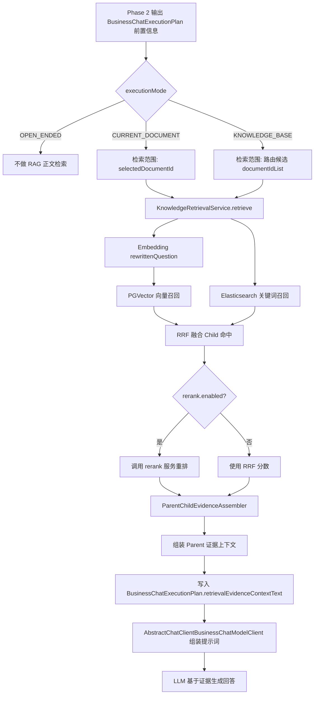
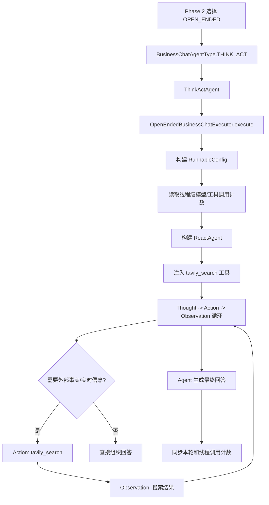
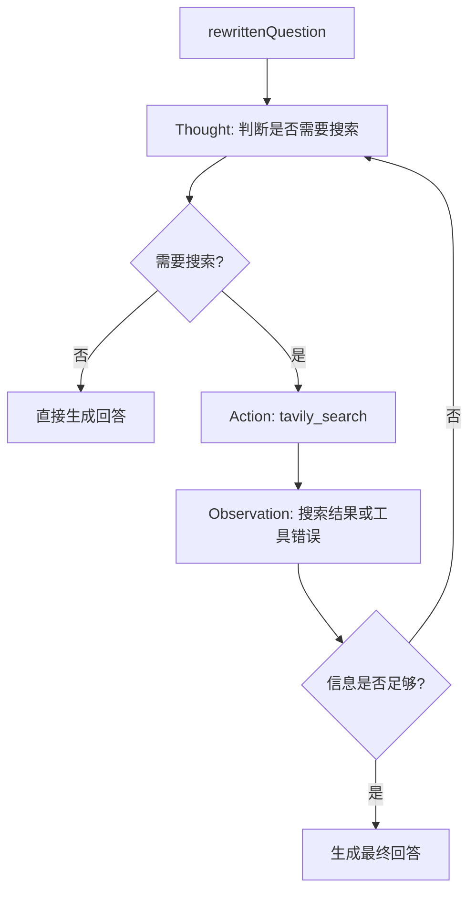

# Phase 3 检索生成与开放式 ReAct Agent 链路

本文说明当前项目中 Phase 3 的两条真实执行分支：

- 知识问答分支：知识路由或当前文档范围已经确定之后，检索正文证据并交给 LLM 生成回答。
- 开放式 Agent 分支：开放式问题进入 ReAct Agent，按 Thought -> Action -> Observation 的方式决定是否调用联网搜索工具，再生成最终回答。

它覆盖文档解析后的检索索引构建、PGVector 和 Elasticsearch 双通道召回、RRF 融合、可选 rerank、Parent 证据组装、预算控制、证据上下文如何进入模型提示词，以及开放式 Agent 的工具调用、调用上限和失败边界。

这里需要先明确一个边界：当前项目已经实现了检索证据链路和证据预算控制，但还没有独立的“证据充分性评估器”。所谓证据评估目前体现在召回阈值、RRF 融合、可选 rerank、Parent TopK、正文长度限制，以及模型提示词中的证据边界约束。

## 总览

Phase 2 已经根据 `chatMode` 和澄清规则选出本轮执行器。Phase 3 不是单一路径，而是分成两条主链路：

| 分支 | 入口条件 | 执行器 | 核心能力 |
| --- | --- | --- | --- |
| RAG 检索 + 生成 | `CURRENT_DOCUMENT` 或稳定的 `KNOWLEDGE_BASE` | `THINK_ACT` / `KNOWLEDGE_QA` 对应执行器 | 在确定文档范围内检索正文证据并生成回答 |
| ReAct Agent | `OPEN_ENDED` | `OpenEndedBusinessChatExecutor` | 判断是否需要外部事实或实时信息，必要时调用 `tavily_search` |

### 知识问答分支



### 开放式 Agent 分支



## Phase 3 的输入

Phase 3 的入口仍在 `BusinessChatOrchestratorImpl.orchestrate()` 内部。Phase 2 完成问题改写、知识路由、澄清判断和当前文档画像加载后，会调用 `retrieveEvidence(...)`。

真正进入检索服务的对象是：

```text
KnowledgeRetrievalRequest(
    question,
    documentIdList
)
```

其中：

- `question` 使用改写后的 `rewrittenQuestion`
- `documentIdList` 是本轮允许读取正文证据的文档范围

不同模式的检索范围：

| 模式 | 检索范围 | 是否读取正文证据 |
| --- | --- | --- |
| `OPEN_ENDED` | 空 | 否 |
| `CURRENT_DOCUMENT` | `selectedDocumentId` | 是 |
| `KNOWLEDGE_BASE` | 知识路由候选文档 ID 去重后列表 | 是 |

如果本轮需要澄清，Phase 3 不检索正文，直接返回空证据。原因是文档范围尚未确定，提前检索会把错误范围的证据带入回答。

`OPEN_ENDED` 不进入 RAG 正文检索，但仍属于 Phase 3。它由 `BusinessChatOrchestratorImpl.selectAgentType(...)` 选为 `BusinessChatAgentType.THINK_ACT`，再由 `ThinkActAgent` 交给 `BusinessChatExecutorRegistry` 中的 `OpenEndedBusinessChatExecutor` 执行。

## 文档入库后的检索索引

文档解析成功后，`KnowledgeManageServiceImpl.processDocumentParseTask(...)` 不直接构建检索索引，而是先生成并保存切块策略方案：

```text
super_agent_document_strategy_plan
super_agent_document_strategy_step
```

用户确认策略后，`KnowledgeManageServiceImpl.confirmStrategy(...)` 创建索引构建任务并发布 Kafka 消息：

```text
super-agent.document.index.requested
```

Kafka 消费端进入 `KnowledgeManageServiceImpl.processDocumentIndexTask(...)`，校验 document 当前索引任务、当前策略方案和 confirmed 状态一致后，再调用：

```text
retrievalIndexService.rebuildIndex(completedDocumentData, taskId, structureNodes, parsedText, strategySteps)
```

`KnowledgeRetrievalIndexService` 负责按已确认策略把解析正文转成检索资产。

写入目标：

| 目标 | 表或索引 | 用途 |
| --- | --- | --- |
| MySQL | `super_agent_document_parent_block` | 保存 Parent 证据块完整正文 |
| MySQL | `super_agent_document_chunk` | 保存 Child 检索块和状态 |
| PGVector | `public.super_agent_document_embedding` | 保存 Child embedding，用于语义召回 |
| Elasticsearch | `super_agent_document_chunk` | 保存 Child 文本字段，用于关键词召回 |

当前策略执行规则：

- Parent 最大长度：`2400` 字符
- Child 最大长度：`700` 字符
- 优先使用结构节点 `contentText` 构造 Parent
- 如果结构节点没有正文，则使用整篇 `parsedText` 构造检索索引
- Child 继承 Parent 的 `sectionPath`、`structureNodeId`、`canonicalPath` 等结构信息
- 策略方案必须包含结构切块和递归分块
- 语义分块开启时按句子边界精修 Child 边界
- LLM 智能切块开启时调用当前可用模型生成 JSON 数组，并严格校验不改写、不丢字、不超长

这里的“使用整篇 parsedText”发生在索引构建阶段，不发生在运行时回答阶段：如果文档解析没有产出结构化节点正文，仍然必须基于已解析正文生成检索索引。

## 双通道混合检索

`KnowledgeRetrievalServiceImpl.retrieve(...)` 同时启动两个检索通道。

### PGVector 通道

PGVector 通道先调用 `KnowledgeEmbeddingClient.embed(question)`，再进入 `PgVectorKnowledgeRetriever.search(...)`。

查询逻辑：

```sql
SELECT id, document_id, parent_block_id, chunk_no, section_path, chunk_text,
       1 - (embedding <=> ?::vector) AS similarity
FROM public.super_agent_document_embedding
WHERE status = 1
  AND document_id IN (...)
  AND 1 - (embedding <=> ?::vector) >= minSimilarity
ORDER BY embedding <=> ?::vector
LIMIT topK
```

当前配置项：

```yaml
super-agent:
  knowledge:
    retrieval:
      vector:
        top-k: 40
        min-similarity: 0.45
```

向量通道只在 `documentIdList` 范围内检索，不能跨过 Phase 2 给出的文档边界。

### Elasticsearch 通道

Elasticsearch 通道由 `ElasticsearchKnowledgeRetriever.search(...)` 执行。

查询字段：

```text
chunkText^4
sectionPath^2
canonicalPath^2
documentName
```

过滤条件：

- `documentId` 必须在本轮允许文档范围内
- `status = 1`

命中后会用相对阈值过滤低分结果：

```text
minScore = topScore * relativeThreshold
```

当前配置项：

```yaml
super-agent:
  knowledge:
    retrieval:
      keyword:
        top-k: 40
        relative-threshold: 0.35
```

## RRF 融合

双通道返回的都是 Child 命中：

```text
KnowledgeRetrievalChildHit
```

`KnowledgeRrfFusionService.fuse(...)` 按 `chunkId` 聚合同一个 Child 在不同通道的命中，并计算 RRF 分数：

```text
score = sum(1 / (k + rank))
```

当前配置：

```yaml
super-agent:
  knowledge:
    retrieval:
      rrf:
        k: 60
      child-top-k: 40
```

融合结果会保留命中通道列表：

```text
VECTOR
KEYWORD
```

这使后续 Parent 证据可以说明每条证据来自向量、关键词，还是两个通道共同命中。

## 可选 rerank

`KnowledgeRerankService.rerank(...)` 只在配置开启时执行：

```yaml
super-agent:
  knowledge:
    retrieval:
      rerank:
        enabled: false
```

关闭时，最终分数就是 RRF 分数。开启时，会调用外部 `/rerank` 接口，传入：

- `model`
- `query`
- `documents`

rerank 返回的 `relevance_score` 会成为 `KnowledgeRetrievalFusedChild.finalScore()`。如果 rerank 返回非法索引或响应结构不符合预期，链路直接抛错，不吞掉错误，也不静默改用 RRF 结果。

## Parent 证据组装

Child 只是检索粒度，不直接作为最终证据交给模型。最终由 `ParentChildEvidenceAssembler.assemble(...)` 把 Child 聚合回 Parent。

组装规则：

1. 收集融合后的 `parentBlockId`
2. 从 MySQL `super_agent_document_parent_block` 读取 Parent 正文
3. 如果 Parent 缺失或正文为空，直接抛错
4. 按 Parent 下最高 Child `finalScore` 排序
5. 截取 `final-parent-top-k`
6. 每个 Parent 正文限制在 `max-parent-chars`

当前配置：

```yaml
super-agent:
  knowledge:
    retrieval:
      final-parent-top-k: 6
      max-parent-chars: 12000
```

最终证据对象是：

```text
KnowledgeRetrievalParentEvidence(
    parentBlockId,
    documentId,
    documentName,
    sectionPath,
    parentText,
    score,
    hitChunkIdList,
    channels
)
```

同时会生成给 LLM 的纯文本证据上下文：

```text
证据1
文档ID：...
文档名称：...
章节路径：...
命中通道：VECTOR,KEYWORD
命中Child：[...]
Parent正文：
...
```

## 证据预算控制

当前项目中的预算控制不是单独的 Agent，而是由检索配置和证据组装规则共同完成。

实际控制点：

| 控制点 | 位置 | 当前作用 |
| --- | --- | --- |
| `vector.top-k` | PGVector 召回 | 限制向量通道候选数量 |
| `vector.min-similarity` | PGVector 召回 | 剔除低相似度向量命中 |
| `keyword.top-k` | Elasticsearch 召回 | 限制关键词通道候选数量 |
| `keyword.relative-threshold` | Elasticsearch 召回 | 剔除低于相对阈值的关键词命中 |
| `child-top-k` | RRF 融合后 | 限制融合 Child 数量 |
| `final-parent-top-k` | Parent 组装 | 限制最终证据段数量 |
| `max-parent-chars` | Parent 组装 | 限制每段 Parent 正文长度 |

这些控制点共同保证模型不会拿到整篇文档，而是拿到本轮问题相关的少量 Parent 证据。

## 证据驱动生成

Phase 3 的输出写入 `BusinessChatExecutionPlan`：

```text
retrievalEvidenceContextText
retrievalEvidenceList
```

模型调用由 `AbstractChatClientBusinessChatModelClient.stream(...)` 组装提示词。这里有两个关键约束：

- 知识库模式下，知识路由候选只表示检索范围，不等于正文证据
- 当前文档问答模式下，只能围绕当前文档画像上下文和检索证据上下文回答

因此，真正能支撑文档事实回答的是：

```text
检索证据上下文
```

不是：

```text
知识路由候选
当前文档名称
当前文档画像
```

如果 `retrievalEvidenceContextText` 为空，模型应该说明证据不足，而不是根据文档标题或路由候选编造正文内容。

## 开放式 ReAct Agent

开放式分支只处理 `OPEN_ENDED` 问题。它的执行类是 `OpenEndedBusinessChatExecutor`，不是 `AbstractChatClientBusinessChatExecutor` 的普通一次性模型调用。

执行入口：

```text
OpenEndedBusinessChatExecutor.execute(runtimeContext, executionPlan)
```

核心对象：

| 对象 | 作用 |
| --- | --- |
| `ReactAgent` | 执行 Thought -> Action -> Observation 循环 |
| `tavily_search` | 唯一注册的联网搜索工具 |
| `RunnableConfig` | 保存 threadId 和模型/工具调用计数上下文 |
| `MysqlSaver` | 保存 Agent checkpoint |
| `RedissonClient` | 保存线程级模型/工具调用计数 |

### Agent 构建

`OpenEndedBusinessChatExecutor.buildAgent(...)` 会基于本轮模型配置构建支持工具调用的 `ChatClient`：

```text
modelClient.buildToolCallingStreamingChatClient(modelConfig)
```

然后注册 `tavily_search` 工具：

```text
FunctionToolCallback.builder("tavily_search", tavilySearchService)
```

工具输入结构只有一个必填字段：

```json
{
  "query": "需要联网搜索的问题或关键词"
}
```

当前没有注册其他业务工具，因此开放式 Agent 的 Action 只能是模型自身思考或 `tavily_search`。

### Agent 指令

`buildInstruction(...)` 把 Phase 2 产出的执行计划转成 Agent 指令。

指令中的关键边界：

- 只处理已经确认的 `OPEN_ENDED` 问题
- 回答前判断是否需要外部事实、实时信息或多步搜索
- 需要时使用 `tavily_search`
- 不需要时直接回答
- 不替代知识库问答或当前文档问答
- 如果问题明显要求内部知识库材料，应说明本轮执行模式不包含知识库检索
- 搜索结果必须转成可核验中文回答
- 区分事实、推断和不确定信息
- 搜索失败、超过调用上限或证据不足时，必须说明无法确认实时信息

Agent 指令会带入：

```text
原始问题
改写问题
时效性判断
历史上下文
```

它不会带入 `retrievalEvidenceContextText`，因为开放式分支不执行知识库正文检索。

### Thought Action Observation

当前项目使用 Alibaba Agent Framework 的 `ReactAgent` 执行循环。循环本身由框架完成，业务代码负责提供：

- 模型客户端
- Agent 指令
- 工具列表
- checkpoint saver
- hook
- interceptor
- 并行工具执行参数

运行时大致行为是：



这里的 Thought、Action、Observation 是 Agent 框架内部推理过程，不作为项目自己的业务状态机落库。

### 调用预算控制

开放式 Agent 分支有独立预算控制，配置在：

```yaml
super-agent:
  chat:
    runtime:
      max-model-calls-per-run: 8
      max-model-calls-per-thread: 40
      max-tavily-tool-calls-per-run: 6
      max-tavily-tool-calls-per-thread: 30
      max-parallel-tools: 4
      tavily-max-retries: 2
      tavily-retry-initial-delay-ms: 200
      tavily-retry-max-delay-ms: 1200
```

预算分两层：

| 预算 | 作用域 | 存储位置 |
| --- | --- | --- |
| `maxModelCallsPerRun` | 单轮执行 | `RunnableConfig.context()` |
| `maxModelCallsPerThread` | 整个会话线程 | Redisson 计数 |
| `maxTavilyToolCallsPerRun` | 单轮执行 | `RunnableConfig.context()` |
| `maxTavilyToolCallsPerThread` | 整个会话线程 | Redisson 计数 |

对应 hook：

- `ModelCallLimitHook`
- `ToolCallLimitHook`

两者的 `exitBehavior` 都是 `ERROR`。超过预算时直接失败，不继续生成不受控回答。

### 工具重试与错误处理

`tavily_search` 额外配置了：

- `ToolRetryInterceptor`
- `ToolErrorInterceptor`

重试参数来自 `BusinessChatRuntimeProperties`：

- 最大重试次数：`tavilyMaxRetries`
- 初始延迟：`tavilyRetryInitialDelayMs`
- 最大延迟：`tavilyRetryMaxDelayMs`
- backoff：`2D`
- jitter：开启

工具执行超时固定为 `20` 秒：

```text
toolExecutionTimeout(Duration.ofSeconds(20))
```

并行工具执行开启：

```text
parallelToolExecution(true)
maxParallelTools(runtimeProperties.getMaxParallelTools())
```

### 计数同步

执行结束时，`syncAgentCounters(...)` 会把 Agent 框架上下文里的计数同步回两处：

- `runtimeContext.incrementModelCallCount()`
- Redisson 线程级计数 key

当前 key：

```text
super-agent:chat:model-calls:thread:{conversationId}
super-agent:chat:tool-calls:thread:{conversationId}:tavily_search
```

这保证同一会话后续轮次会继承历史调用次数，不会只限制单轮。

### 开放式分支边界

开放式 Agent 分支不读取：

- Neo4j 知识路由正文
- 当前文档正文
- PGVector
- Elasticsearch 文档索引
- `retrievalEvidenceContextText`

它只解决开放式问题中的外部事实、实时信息和多步搜索。用户如果实际想问内部文档，应选择当前文档问答或知识库问答模式，而不是让开放式 Agent 去猜内部知识。

## 失败路径

Phase 3 不做静默替代。核心失败会直接暴露。

### RAG 分支失败

| 失败位置 | 典型原因 | 当前行为 |
| --- | --- | --- |
| Embedding | API Key、baseUrl、model 缺失或接口失败 | 抛出异常 |
| PGVector | 数据库不存在、表不存在、vector 扩展缺失、向量维度不匹配 | 抛出异常 |
| Elasticsearch | 服务不可达、索引不存在、mapping 不匹配 | 抛出异常 |
| Parent 组装 | Child 命中了但 MySQL Parent 缺失 | 抛出异常 |
| Parent 正文 | Parent 存在但正文为空 | 抛出异常 |
| rerank | 返回结构非法或索引越界 | 抛出异常 |

这符合当前项目规则：不能用默认值、fallback、吞错掩盖业务问题。检索链路坏了就应该修数据、配置或索引，而不是让 LLM 假装读到了文档。

### ReAct 分支失败

| 失败位置 | 典型原因 | 当前行为 |
| --- | --- | --- |
| Tavily 配置 | API Key 缺失或服务不可用 | 工具调用失败 |
| 工具执行 | 搜索超时、搜索失败、响应异常 | 按工具拦截器处理，最终仍不足则说明无法确认 |
| 模型调用预算 | 单轮或线程模型调用超过上限 | `ModelCallLimitHook` 抛错 |
| 工具调用预算 | 单轮或线程 Tavily 调用超过上限 | `ToolCallLimitHook` 抛错 |
| checkpoint | MySQL checkpoint 表缺失或不可写 | Agent 执行失败 |
| Redisson | 线程计数读取或同步失败 | Agent 执行失败 |

## 与 Phase 2 的边界

Phase 2 解决“本轮应该进入哪条执行分支”的问题。

Phase 3 解决“在选定分支内如何执行”的问题：

- RAG 分支解决“在这些文档里读哪些正文证据”
- ReAct 分支解决“开放式问题是否需要搜索、如何调用工具、如何生成最终回答”

二者不能混在一起：

- Neo4j 路由候选不保存正文，不作为事实证据
- 当前文档画像只描述文档边界和可答范围，不替代正文
- RAG 检索只能在 Phase 2 确定的文档范围内执行
- LLM 生成只能基于 Phase 3 输出的检索证据上下文回答文档事实
- 开放式 ReAct Agent 不能替代知识库问答，也不能读取内部文档正文
- `tavily_search` 只服务外部事实和实时信息核验，不服务内部知识库检索

## 全链路验证

验证 Phase 3 时不能只看接口返回“能回答”，必须分别验证 RAG 分支和 ReAct 分支的输入、处理、输出和下游影响。

### RAG 输入验证

- `CURRENT_DOCUMENT` 模式必须有合法 `selectedDocumentId`
- `KNOWLEDGE_BASE` 模式必须先得到稳定路由候选，且没有进入澄清分支
- 目标文档必须 `parse_status = 3`
- 目标文档必须有解析正文 `parse_text_path`
- 目标文档必须有 Parent/Child、PGVector、Elasticsearch 三类索引

可检查：

```sql
SELECT id, document_name, parse_status, index_status, last_index_task_id
FROM super_agent_document
WHERE id = ?;

SELECT COUNT(*)
FROM super_agent_document_parent_block
WHERE document_id = ? AND status = 1;

SELECT COUNT(*)
FROM super_agent_document_chunk
WHERE document_id = ? AND status = 1;
```

### RAG 处理验证

- PGVector 查询只返回目标 `documentIdList` 内的数据
- Elasticsearch 查询只返回目标 `documentIdList` 内的数据
- RRF 融合后 `channels` 能反映命中来源
- rerank 关闭时使用 RRF 分数
- rerank 开启时使用 rerank 分数
- Parent 证据能从 MySQL 正确反查

### RAG 输出验证

`BusinessChatExecutionPlan` 应包含：

- `retrievalEvidenceContextText` 非空
- `retrievalEvidenceList` 数量不超过 `final-parent-top-k`
- `executionStepList` 中显示“检索证据上下文：N个Parent证据”

模型提示词中应出现：

```text
检索证据上下文：
证据1
...
Parent正文：
...
```

### ReAct 输入验证

- `executionMode` 必须是 `OPEN_ENDED`
- `agentType` 应是 `THINK_ACT`
- `BusinessChatExecutorRegistry` 应选择 `OpenEndedBusinessChatExecutor`
- `TAVILY_API_KEY` 必须已配置
- MySQL checkpoint 表必须存在
- Redisson 必须可用

### ReAct 处理验证

- `RunnableConfig.threadId` 等于 `conversationId`
- 线程级模型调用计数能从 Redisson 读取
- 线程级 Tavily 调用计数能从 Redisson 读取
- Agent instruction 包含原始问题、改写问题、时效性判断和历史上下文
- 需要外部事实或实时信息的问题会触发 `tavily_search`
- 不需要搜索的问题可以直接生成回答
- 超过模型或工具调用预算时会失败

### ReAct 输出验证

- 流式输出只推送有文本的 message delta
- 搜索结果必须被组织成中文回答
- 回答中要区分事实、推断和不确定信息
- 搜索失败或证据不足时，不能编造实时信息
- 执行结束后，本轮和线程级调用计数完成同步

### 下游影响验证

- 当前文档问答只能围绕当前文档证据回答
- 知识库问答只能围绕路由候选范围内的证据回答
- 如果证据为空，回答应说明证据不足
- 不应把知识路由候选当作正文内容
- 不应把文档标题、摘要、术语画像当作事实依据
- 开放式问答不应声称已经读取内部知识库或当前文档
- 开放式问答需要实时信息且工具不可用时，应说明无法确认

### 回归影响

需要覆盖以下场景：

- 当前文档模式：已选文档有索引，能召回 Parent 证据
- 当前文档模式：已选文档无索引，应暴露索引问题或回答证据不足
- 知识库模式：路由候选稳定，能进入 RAG 检索
- 知识库模式：需要澄清，不执行 RAG 检索
- 开放式模式：不执行 RAG 检索
- 开放式模式：实时外部事实问题会进入 ReAct 工具调用链路
- 开放式模式：普通非实时问题可直接回答
- 开放式模式：Tavily 调用超过单轮上限时失败
- PGVector 或 Elasticsearch 任一配置错误时，异常能暴露根因

## 当前实现边界

当前 Phase 3 已完成：

- 文档解析后构建 Parent/Child 检索索引
- PGVector 向量召回
- Elasticsearch 关键词召回
- RRF 融合
- 可选 rerank
- Parent 证据组装
- 检索证据进入 LLM 提示词
- 基于证据上下文约束生成
- 开放式 ReAct Agent
- `tavily_search` 联网搜索工具
- 模型调用和 Tavily 工具调用预算
- 工具重试、工具错误拦截和并行工具执行
- Agent checkpoint

当前 Phase 3 尚未实现：

- 独立证据充分性评分
- 多证据冲突检测
- 引用格式化输出
- 按 token 精确预算
- 按问题类型动态调整 TopK
- 证据覆盖率指标
- 多工具规划
- 内部业务工具调用
- ReAct 思考过程的业务级可观测明细
- 搜索结果来源引用结构化归档

这些能力如果后续要做，应直接补在证据评估层或证据生成层，不应在模型提示词外围添加临时特判。
