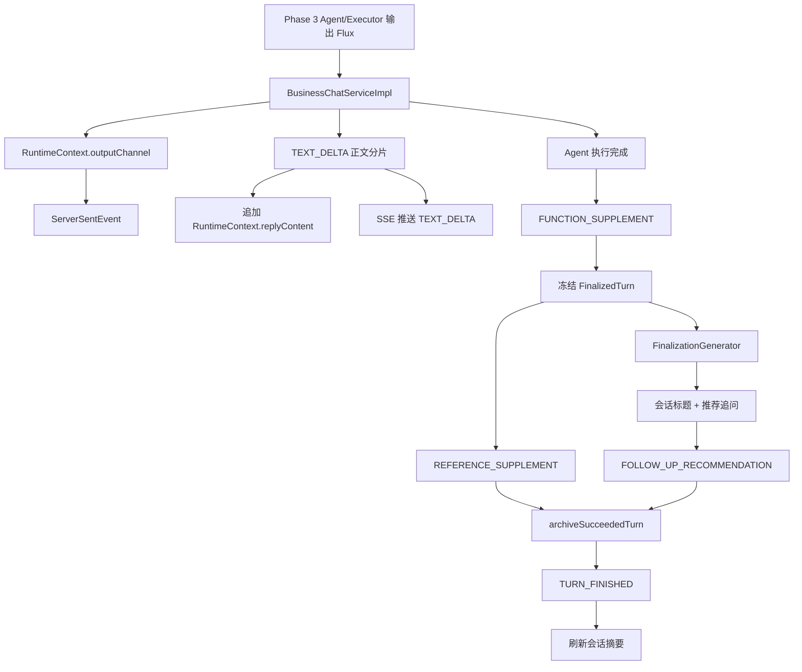
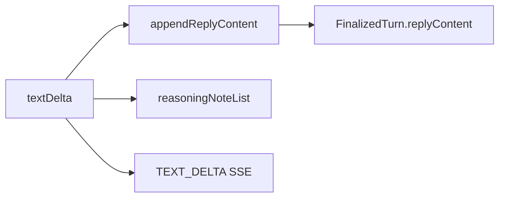

# Phase 4 SSE 流式输出与收尾归档链路

本文说明当前项目中 Phase 4 的真实实现：Agent 已经开始执行后，服务端如何把正文分片、执行补充信息、引用来源、推荐追问和终态事件通过 SSE 推给前端，并把同一轮回答归档成可查询的历史记录。

这里先明确一个边界：当前项目已经有 `REFERENCE_SUPPLEMENT` 事件和 `sourceSnapshotList` 归档字段，但当前代码还没有把 Phase 3 的 `retrievalEvidenceList` 转成引用来源写入 `runtimeContext.sourceSnapshotList`。因此“引用来源”这条输出通道已经存在，但引用内容目前为空。

## 总览



## SSE 入口

前端请求入口是：

```text
POST /api/chat/stream
```

Controller 返回的是：

```text
Flux<ServerSentEvent<BusinessChatStreamEvent>>
```

核心服务方法是：

```text
BusinessChatServiceImpl.streamChat(request)
```

`streamChat(...)` 不直接同步执行模型，而是构建两条流：

| 流 | 职责 |
| --- | --- |
| `outputFlux` | 从 `runtimeContext.outputChannel` 读取事件并包装成 SSE |
| `executionFlux` | 后台执行编排、Agent、收尾归档和资源释放 |

两条流通过 `mergeWith` 合并。这样前端可以持续收到输出事件，而后台执行链路仍能在成功、失败或断开时完整收束。

## 输出通道

每轮对话都会注册一个 `BusinessChatRuntimeContext`。其中：

```text
Sinks.Many<BusinessChatStreamEvent> outputChannel
```

是本轮 SSE 事件出口。

统一包装逻辑：

```text
BusinessChatStreamEvent -> ServerSentEvent<BusinessChatStreamEvent>
```

SSE 的 event 名称来自：

```text
BusinessChatStreamEvent.eventType()
```

因此前端不需要从 data 内再推断事件类型，直接按 SSE event name 分流即可。

## 事件顺序

成功路径的当前事件顺序是：

```text
EXECUTION_PROGRESS
AGENT_STARTED
TEXT_DELTA...
AGENT_FINISHED
FUNCTION_SUPPLEMENT
REFERENCE_SUPPLEMENT
FOLLOW_UP_RECOMMENDATION
TURN_FINISHED
```

对应测试已经固定该顺序：

```text
BusinessChatServiceImplTest.shouldStreamTextSupplementFollowupsAndFinishEvents
```

这条顺序是前端展示和数据库终态共同认可的顺序，不应随意调整。

## 事件结构

所有 SSE data 都是 `BusinessChatStreamEvent`：

```text
eventType
conversationId
exchangeId
chatMode
textDelta
functionSupplement
sourceSnapshotList
followUpSuggestionList
message
agentType
agentName
firstTokenLatencyMs
totalLatencyMs
```

不同事件只填自己负责的字段。

| 事件 | 主要字段 | 含义 |
| --- | --- | --- |
| `EXECUTION_PROGRESS` | `message` | 编排和执行进度 |
| `AGENT_STARTED` | `agentType`、`agentName`、`message` | Agent 开始处理 |
| `TEXT_DELTA` | `textDelta` | 模型正文增量 |
| `AGENT_FINISHED` | `agentType`、`agentName`、`message` | Agent 处理完成 |
| `FUNCTION_SUPPLEMENT` | `functionSupplement` | Agent 和模型补充信息 |
| `REFERENCE_SUPPLEMENT` | `sourceSnapshotList` | 引用来源列表 |
| `FOLLOW_UP_RECOMMENDATION` | `followUpSuggestionList` | 推荐追问 |
| `TURN_FINISHED` | `message`、`totalLatencyMs` | 成功完成 |
| `TURN_FAILED` | `message`、`totalLatencyMs` | 失败完成 |
| `TURN_REJECTED` | `message` | 会话正在执行，拒绝新轮次 |

## 正文分片推送

正文分片来自 Phase 3 Agent/Executor 返回的：

```text
Flux<String>
```

`BusinessChatServiceImpl` 对每个 `textDelta` 执行：

1. 首个 token 到达时记录 `firstTokenLatencyMs`
2. 追加到 `runtimeContext.replyContentBuilder`
3. 写入 `reasoningNoteList`
4. 推送 `TEXT_DELTA`

关键点：正文不是只推给前端，也会同步写入运行态缓冲区。成功、失败、中止归档都从这个缓冲区冻结完整回答。



## 引用来源输出

当前引用来源事件是：

```text
REFERENCE_SUPPLEMENT
```

事件字段：

```text
sourceSnapshotList
```

收尾时调用：

```text
pushReferenceSupplement(runtimeContext, finalizedTurn)
```

它会把 `finalizedTurn.sourceSnapshotList()` 推给前端，并在归档时写入 `business_chat_exchange.source_snapshot_list`。

当前实现边界：

- `RuntimeContext` 已有 `sourceSnapshotList`
- `FinalizedTurn` 已冻结 `sourceSnapshotList`
- SSE 已推送 `REFERENCE_SUPPLEMENT`
- 数据库已归档 `sourceSnapshotList`
- 但当前没有代码把 Phase 3 的 `retrievalEvidenceList` 转成引用快照加入 `sourceSnapshotList`

因此，如果需要让图中的“正文分片推送 + 引用来源”真正带来源，需要在 Phase 3 证据生成后、Phase 4 冻结前，把 `BusinessChatExecutionPlan.retrievalEvidenceList` 转成稳定引用文本写入：

```text
runtimeContext.getSourceSnapshotList()
```

这应该在主链路的根因位置补，不应在前端或归档查询时临时拼。

## 执行补充信息

`FUNCTION_SUPPLEMENT` 当前只输出两类信息：

```text
Agent：...
执行模型：...
```

来源：

```text
pushFunctionSupplement(runtimeContext)
```

同时会写入：

```text
runtimeContext.toolTraceList
```

完整执行计划不会直接推给前端，而是进入 `debugTraceJson`，用于后台观测页复盘。

## 推荐追问

推荐追问在成功收尾阶段生成，不和正文流并行生成。

入口：

```text
finalizeTitleAndRecommendation(runtimeContext, frozenTurn)
```

调用：

```text
BusinessChatFinalizationGenerator.generate(runtimeContext, frozenTurn, titleRequired)
```

生成输入来自已经冻结的 `FinalizedTurn`：

- 用户问题
- 助手回答
- 引用快照
- 执行模式
- 是否需要会话标题
- 是否启用推荐追问

模型必须返回 JSON：

```json
{
  "dialogueTitle": "会话标题",
  "followUpSuggestionList": ["推荐追问1", "推荐追问2", "推荐追问3"]
}
```

推荐追问数量来自配置：

```yaml
super-agent:
  chat:
    recommendation:
      enabled: true
      count: 3
```

当前默认最多 3 个，不是前端随意截断。后端会强校验：

- `followUpSuggestionList` 数量必须等于配置值
- 每项不能为空
- 去重后仍必须满足数量
- 关闭推荐追问时必须返回空数组

生成成功后：

1. 写回 `runtimeContext.followUpSuggestionList`
2. 构造带推荐追问的 `FinalizedTurn`
3. 推送 `FOLLOW_UP_RECOMMENDATION`
4. 归档到 `followup_suggestion_list`

## 会话标题

标题只在会话没有标题时生成。

判断：

```text
titleRequired = !businessChatPersistenceService.dialogueTitleExists(frozenTurn)
```

如果需要标题，生成后调用：

```text
updateDialogueTitleIfAbsent(...)
```

后续轮次不会覆盖已有标题。

## 成功收尾

成功收尾入口：

```text
finalizeSucceededTurn(runtimeContext)
```

核心顺序：

1. `markFinalized()` 抢占终态归档权
2. 开启 `FINALIZE` trace stage
3. 冻结 `FinalizedTurn`
4. 生成标题和推荐追问
5. 推送引用来源
6. 推送推荐追问
7. `archiveSucceededTurn(finalizedTurn)`
8. 完成 `FINALIZE` trace stage
9. 推送 `TURN_FINISHED`
10. 异步刷新会话摘要

`FinalizedTurn` 是成功收尾的唯一快照来源。SSE 补发、数据库归档、debugTrace、摘要刷新都读这一份快照，避免不同环节看到不同版本的正文或伴随信息。

## 归档内容

成功、失败、中止最终都会更新同一条 exchange。

成功归档写入：

| 字段 | 来源 |
| --- | --- |
| `reply_content` | `FinalizedTurn.replyContent` |
| `reasoning_note_list` | `FinalizedTurn.reasoningNoteList` |
| `source_snapshot_list` | `FinalizedTurn.sourceSnapshotList` |
| `followup_suggestion_list` | `FinalizedTurn.followUpSuggestionList` |
| `tool_trace_list` | `FinalizedTurn.toolTraceList` |
| `debug_trace_json` | traceId、intentAnalysis、executionPlan、modelCallCount、leaseKey |
| `exchange_state` | `COMPLETED` |
| `first_token_latency_ms` | 首 token 延迟 |
| `total_latency_ms` | 总耗时 |

归档完成后，dialogue 回到 `IDLE`。

## 失败和中止

### 失败

模型异常、编排异常、租约续期失败都会进入：

```text
handleExecutionFailure(runtimeContext, error)
```

行为：

- 冻结当前运行态
- 归档 `FAILED`
- 保留已经输出的正文片段
- 推送 `TURN_FAILED`
- 释放运行态和会话租约

### 中止

客户端断开时 Reactor 会收到 `SignalType.CANCEL`。

处理：

```text
handleExecutionCancellation(runtimeContext, signalType)
```

行为：

- 抢占 `markFinalized()`
- 归档 `STOPPED`
- 保留已经生成的内容
- 释放运行态和会话租约

客户端断开不等于服务端可以丢弃本轮状态；已生成内容仍要归档。

## 会话租约和资源释放

Phase 4 仍受 Redis 会话租约保护。

启动时获取租约：

```text
tryAcquireConversationLease(...)
```

执行期间每 10 秒续租：

```text
LEASE_RENEW_INTERVAL = 10s
```

租约 TTL：

```text
CONVERSATION_LEASE_TTL = 30s
```

主执行流完成后停止续租。成功、失败、中止都会在 `doFinally` 中：

- 关闭 outputChannel
- 注销 RuntimeContext
- 释放 Redis lease

如果同一个 conversationId 正在执行，新请求会直接返回：

```text
TURN_REJECTED
```

## 全链路验证

### 输入验证

- 请求必须能归一化成 `BusinessChatStartPlan`
- conversationId 必须能拿到 Redis lease
- exchange 必须先以 `RUNNING` 创建
- RuntimeContext 必须注册成功
- outputChannel 必须绑定到 SSE

### 输出顺序验证

成功路径必须保持：

```text
EXECUTION_PROGRESS
AGENT_STARTED
TEXT_DELTA...
AGENT_FINISHED
FUNCTION_SUPPLEMENT
REFERENCE_SUPPLEMENT
FOLLOW_UP_RECOMMENDATION
TURN_FINISHED
```

### 正文验证

- 每个 `TEXT_DELTA` 都必须追加到 `replyContentBuilder`
- 前端收到的正文拼接结果应等于归档 `reply_content`
- 首个 `TEXT_DELTA` 应记录 `firstTokenLatencyMs`

### 引用验证

- `REFERENCE_SUPPLEMENT` 必须在推荐追问前推送
- `sourceSnapshotList` 必须与归档字段一致
- 当前如果引用为空，应能从实现上追溯到 `runtimeContext.sourceSnapshotList` 没有写入来源
- 后续补引用时，应从 `retrievalEvidenceList` 生成引用快照，而不是从前端显示文本反推

### 推荐追问验证

- 推荐追问开启时，数量必须等于 `super-agent.chat.recommendation.count`
- 默认数量是 3
- 推荐追问必须非空、去重后数量仍正确
- 推荐追问 SSE 和归档字段必须一致
- 标题只在会话无标题时生成

### 失败验证

- Agent 抛错时应推送 `TURN_FAILED`
- 已输出正文应进入失败归档
- 客户端断开时应归档 `STOPPED`
- 租约释放必须发生
- 已经 finalized 的路径不能被另一条路径重复归档

## 当前实现边界

当前 Phase 4 已完成：

- SSE 输出通道
- 正文增量 `TEXT_DELTA`
- Agent started/finished 事件
- 执行补充信息 `FUNCTION_SUPPLEMENT`
- 引用来源事件 `REFERENCE_SUPPLEMENT`
- 推荐追问事件 `FOLLOW_UP_RECOMMENDATION`
- 成功完成事件 `TURN_FINISHED`
- 失败事件 `TURN_FAILED`
- 会话忙碌拒绝事件 `TURN_REJECTED`
- 成功、失败、中止归档
- 会话标题生成
- 推荐追问生成和强校验
- 会话摘要刷新
- Redis 会话租约续期和释放

当前 Phase 4 尚未完成：

- Phase 3 检索证据到 `sourceSnapshotList` 的引用转换
- 引用来源结构化字段，如文档 ID、章节路径、Parent ID、命中通道
- 前端可点击引用定位
- 工具调用过程的细粒度 SSE 事件
- ReAct Observation 的结构化归档

这些能力如果继续补，应在 Phase 4 的运行态伴随信息写入位置完成，让 SSE、归档和历史查询共用同一份冻结快照。
